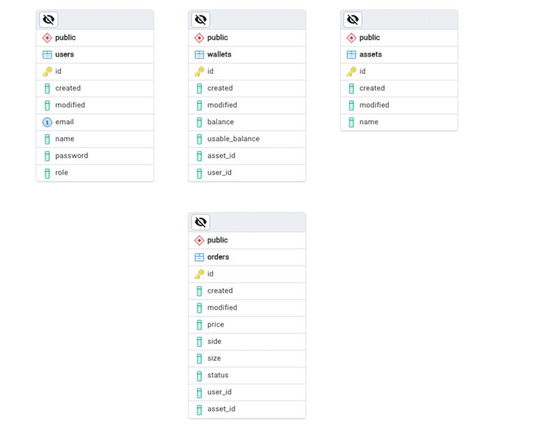

# Java Backend Developer Case (Brokerage Firm Challenge)

This project represents a microservices architecture developed using Spring Boot. 
The application employs JWT (JSON Web Token) for user authentication and consists of the following services:

- **API Gateway**
- **Authentication Service**
- **Order Service**
- **Customer Service**
- **Wallet Service**
- **Transaction Service**
- **PostgreSQL**
- **Rabbit MQ**

## Table of Contents

- [Project Overview](#project-overview)
- [Architecture](#architecture)
- [Installation](#installation)
- [Usage](#usage)
- [Services](#services)
    - [API Gateway](#api-gateway)
    - [Authentication Service](#authentication-service)
    - [Order Service](#order-service)
    - [Customer Service](#customer-service)
    - [Wallet Service](#wallet-service)
    - [Transaction Service](#transaction-service)
- [Using Docker](#using-docker)

## Project Overview

This microservices application provides users with a secure platform to perform transactions. 
JWT-based authentication protects user credentials, and each service operates independently within its responsibility area.

You can find a postman collection export file [**inghubsbe.postman_collection_1.json**] to test endpoints of the project.

## Architecture

The application consists of the following components:

1. **API Gateway:** A central point that routes all requests.
2. **Authentication Service:** Manages user authentication and JWT token generation.
3. **Order Service:** Handles order creation, updating, and tracking.
4. **Customer Service:** Manages customer information and relationships.
5. **Wallet Service:** Deals with user wallet operations (balances, transfers).
6. **Transaction Service:** Records and manages all financial transactions.
7. **PostgreSQL:** 
8. **Rabbit MQ:**

## ERD



## Communication

- **Wallet and Transaction Services:** The wallet and transaction services communicate through a message queue (MQ).
- All other services communicates using HTTP REST
- Auth and api-gateway services are using external and internal network in docker, other services are using only internal network

## Installation

### Requirements

- Java 21 or higher
- Docker and Docker Compose

### Steps

1. Clone this repository:
    ```bash
    git clone https://github.com/wecii/java-be-developer-case.git
    cd java-be-developer-case
    ```

2. Start all services using Docker, (70 seconds approximately)
    ```bash
    docker-compose up --build
    ```

3. The api-gateway will run by default at `http://localhost:8089`.

## Usage

To authenticate using JWT, follow these steps:

1. Create a user registration.
2. Log in to receive a JWT token.
3. Send requests to other services' endpoints using the token.

## Services

### API Gateway

- A central point that routes all service requests.
- Manages authentication and authorization processes.

### Authentication Service

- Handles user registration and login.
- Generates and validates JWT tokens.

### Order Service

- Manages user orders.
- Provides functionalities for creating and canceling orders.

### Customer Service

- Manages user information.
- Executes customer relations and database operations.

### Wallet Service

- Manages user wallet balances.
- Handles transfers and updates related to balances and assets.

### Transaction Service

- Triggers orderbook match method.
- Consumes all transactional methods like deposit, withdraw.

## Using Docker

This project is containerized with Docker. 
You can run all services using Docker Compose. 
Relevant Dockerfiles and configurations are available in the project.

### Docker Commands

- To stop all containers:
    ```bash
    docker-compose down
    ```

- To start a specific service:
    ```bash
    docker-compose up {service_name}
    ```
